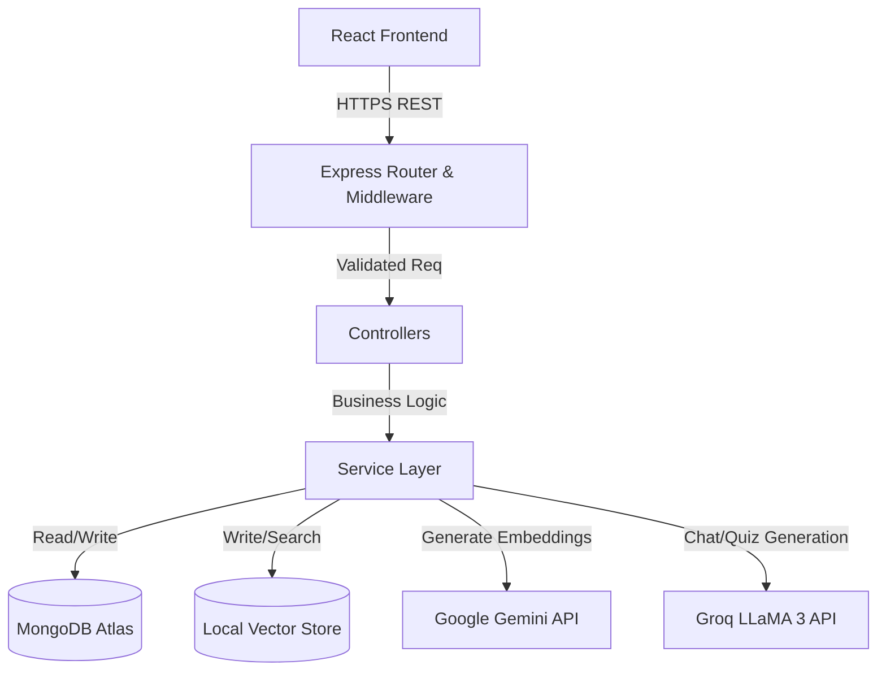

# AI Study Buddy — Complete Interview Handbook (Volume 1)

*Ek aam B.Tech student se FAANG-level engineer banne ka safar.*

---

# CHAPTER 1: PROJECT OVERVIEW

Is chapter mein hum project ke core idea ko samjhenge. Interviewer ka sabse pehla question hamesha yahi hota hai: "Tell me about your project." Agar tum 1st minute mein apna project clearly explain nahi kar paaye, toh aage ke technical answers ka impact kam ho jata hai.

## 1.1 The Project Idea

### What is it?
AI Study Buddy ek full-stack AI application hai. Yeh students ko apne khud ke study materials (PDFs) upload karne deta hai aur phir AI ka use karke un documents se interact karne ki power deta hai. 

### Problem Statement
Normal LLM (jaise ChatGPT) ke paas tumhare specific college notes ya books ka context nahi hota. Agar tum ChatGPT se apne syllabus ka question poochoge, toh wo internet ki general knowledge dega, ya hallucinate (galat answer) karega. 

### The Solution (Business Use Case)
Humne **Retrieval-Augmented Generation (RAG)** ka use kiya hai. Ab AI sirf unhi PDFs ke basis par answer dega jo student ne upload kiye hain. Sath hi mein, yeh app directly notes se MCQs (Quizzes) aur Flashcards bhi generate karta hai.

---

## 1.2 Functional & Non-Functional Requirements

### Functional Requirements (Jo App karta hai)
- User Authentication (Login / Signup)
- PDF file upload (up to 10MB)
- AI Chatbot jo PDF context ko read karke answer deta hai.
- Citation tracking (AI batata hai ki usne PDF ke kis part se answer liya).
- Auto-generation of Quizzes and Flashcards.
- Study dashboard jo streak aur progress track karta hai.

### Non-Functional Requirements (App KAISE perform karta hai)
- **Scalability**: Backend ko stateless rakha gaya hai taaki horizontally scale kiya ja sake.
- **Performance**: Groq LPU ka use kiya hai LLM generation ke liye, jisse response time normal GPU inference se 10x fast hai.
- **Security**: JWT tokens, bcrypt password hashing, rate limiting, aur NoSQL injection protection.
- **Cost Efficiency**: Dual-AI architecture (Gemini for embeddings, Groq for LLM) use kiya hai API costs ko optimize karne ke liye.

---

## 1.3 Interview Pitches (Ratta Maar Lo)

Interview mein situation ke hisaab se pitch karni padti hai. 

### 30-Second Elevator Pitch
"AI Study Buddy is a full-stack RAG application built using React, Node.js, and MongoDB. It allows students to upload their PDF notes and uses a dual-AI pipeline with Google Gemini for vector embeddings and Groq's LLaMA 3 for ultra-fast generation. Students can chat with their notes, generate quizzes, and create flashcards, with every AI response strictly grounded in their uploaded documents."

### 1-Minute Explanation (Focus on Architecture)
"I built AI Study Buddy to solve the hallucination problem in LLMs when studying specific course material. The backend is a REST API built with Node and Express. When a user uploads a PDF, the backend extracts the text, chunks it, and uses Gemini's API to generate 768-dimensional embeddings, storing them in a local vector store. When the user asks a question, the system performs a cosine similarity search to retrieve the most relevant chunks. These chunks are injected into a highly constrained system prompt and sent to Groq's LLaMA 3.3 70B model. This ensures the AI only answers from the student's notes and provides accurate citations. The frontend is built with React and Tailwind, using Zustand for state management."

---
✅ **Quick Revision: Chapter 1**
*   **Problem:** General LLMs hallucinate; lack specific context.
*   **Solution:** RAG pipeline limits AI to user's PDFs.
*   **USP:** Dual-AI strategy (Gemini + Groq) for speed and cost.
*   **Tech:** MERN stack + Google GenAI + Groq SDK.

---

# CHAPTER 2: PROJECT ARCHITECTURE

Interviewer aksar ek white-board de deta hai aur bolta hai "Draw the architecture". 

## 2.1 The High-Level Architecture

---------------------------------------------------
### What is it?
System architecture ek blueprint hota hai jo batata hai ki frontend, backend, database aur third-party APIs (jaise Gemini/Groq) aapas mein data kaise share kar rahe hain.

---------------------------------------------------
### Why is it used in this project?
Humne MERN stack ke saath external AI services ko loosely couple kiya hai. Taaki agar kal ko Groq band ho jaye, toh hum sirf service layer mein ek file change karke OpenAI laga sakein bina pura backend tode.

---------------------------------------------------
### Internal Working

1. **Client Layer:** React app jo browser mein run hota hai. Yeh Axios ke through HTTP requests bhejta hai.
2. **API Gateway / Router Layer:** Express app requests receive karta hai. Yahan par Helmet (security), Rate Limiting, aur JWT Auth middleware chalte hain.
3. **Controller Layer:** Request body validate karta hai (Zod use karke) aur Service ko pass karta hai.
4. **Service Layer (Core Logic):** Yahan asli kaam hota hai. Database queries, PDF parsing, aur AI API calls.
5. **Data Layer:** MongoDB metadata store karta hai, aur `vectors.json` embeddings store karta hai.

---------------------------------------------------
### Real Life Analogy
Restaurant ka example lo:
- **Frontend (Client):** Menu card jahan se tum order (Request) karte ho.
- **Router/Middleware:** Waiter jo check karta hai ki kya tumne sahi table book ki hai (Auth) aur order sahi format mein diya hai (Validation).
- **Controller:** Head Chef jo order receive karta hai.
- **Service Layer:** Kitchen ke alag alag stations (AI station, Database station) jo khana banate hain.
- **Database/Third-party:** Fridge (MongoDB) aur external supplier (Gemini/Groq API) jahan se raw material aata hai.

---------------------------------------------------
### Example from THIS PROJECT



---------------------------------------------------
### Why not Alternatives?

**Why not monolithic server-side rendering (like Django/EJS)?**
Kyunki hamari app bahut interactive hai. Chat interface, smooth animations, aur quiz taking experience ke liye Single Page Application (SPA) React best hai.

**Why not Serverless (AWS Lambda / Next.js API routes)?**
PDF parsing aur embeddings generate karne mein time lagta hai. Serverless functions ka strict timeout hota hai (jaise Vercel ka 10 sec limit free tier mein). Dedicated Express server lambe background tasks (PDF upload) easily handle kar leta hai.

---------------------------------------------------
### Interview Questions
1. "Explain the difference between a Controller and a Service in your architecture."
2. "Why did you choose a dual-AI architecture instead of using just OpenAI for everything?"
3. "Where exactly is your state stored in this architecture?"

---------------------------------------------------
### Ideal Interview Answer

> "I designed the backend using a strict Model-Route-Controller-Service architecture. The Controller acts as a thin wrapper—it handles the HTTP request, validates the input using Zod, and sends the response. All business logic—whether it's database interaction or calling AI APIs—is isolated in the Service layer. This separation of concerns makes the code highly testable. For the AI layer, I implemented a dual-provider strategy. I route embedding tasks to Google Gemini because of the quality of their `text-embedding-004` model, but I route generation tasks to Groq because their LPU hardware provides sub-second latency for LLaMA 3, which is critical for a responsive chat UI."

---------------------------------------------------
### Common Mistakes
- **Mistake:** Bolna ki "React mera backend se directly baat karta hai database update karne ke liye". (Security disaster! Frontend hamesha API se baat karta hai).
- **Mistake:** Controller ke andar hi saara logic likh dena (Spaghetti code).

---
✅ **Quick Revision: Chapter 2**
*   **Client:** React + Tailwind.
*   **API:** Express + Zod + JWT.
*   **Logic:** Services (Separation of concerns).
*   **Data:** MongoDB (Metadata) + Vector JSON (Embeddings).

---

# CHAPTER 3: COMPLETE PROJECT FLOW

Is section mein hum samjhenge ki data step-by-step kaise flow hota hai jab user alag alag actions leta hai.

## 3.1 The Auth Flow (Login/Signup)

---------------------------------------------------
### What is it?
User ka system mein entry lena. Is flow mein password hashing, JWT generation, aur cookie setting shamil hai.

---------------------------------------------------
### Internal Working
1. User email/password frontend form mein dalta hai.
2. React `POST /api/auth/register` par data bhejta hai.
3. Express Zod se check karta hai ki email valid hai aur password > 6 chars hai.
4. `User` Mongoose model ka `pre('save')` hook run hota hai, jo `bcrypt` use karke password ko hash karta hai.
5. `authService` `jwt.sign()` se ek Access Token (short life) aur ek Refresh Token (long life) generate karta hai.
6. Refresh Token ko `HttpOnly` cookie mein set kiya jata hai. Access Token response body mein JSON banke frontend ko milta hai.
7. Frontend Zustand store mein user ka data aur token save kar leta hai.

---------------------------------------------------
### Example from THIS PROJECT
- File: `backend/src/routes/auth.routes.js`
- Controller: `authController.register`
- Service: `authService.generateTokenPair` (Line 23)

---------------------------------------------------
### Ideal Interview Answer
> "My auth flow uses a dual-token JWT strategy for maximum security. When a user logs in, the backend verifies the hashed password using bcrypt. It then generates a short-lived access token and a long-lived refresh token. The crucial part is that I don't send both in the JSON payload. The refresh token is attached to the response as an `HttpOnly` cookie, meaning client-side JavaScript cannot read it, which completely mitigates XSS attacks for the long-lived token."

---

## 3.2 The PDF Upload Flow (The most complex part)

---------------------------------------------------
### What is it?
Jab student ek PDF upload karta hai, usko AI ke samajhne laayak format (embeddings) mein convert karne ka process.

---------------------------------------------------
### Internal Working
1. Frontend `FormData` object banata hai aur PDF file `POST /api/notes/upload` par bhejta hai.
2. Backend par `multer` middleware file ko RAM mein ya temp folder mein receive karta hai.
3. `pdfService.extractText()` us PDF binary file se plain text extract karta hai `pdf-parse` library use karke.
4. `embeddingsService` us text ko LangChain ke `RecursiveCharacterTextSplitter` ko deta hai. Yeh us lambe text ko 1000 characters ke chhote chunks (tukdo) mein todta hai.
5. Ek loop chalta hai jo in saare chunks ko `geminiService.generateEmbeddings()` ko bhejta hai.
6. Gemini ek 768-length ka array of numbers (vector) return karta hai har chunk ke liye.
7. Backend in saare chunks + unke vectors ko `vectors.json` file mein append kar deta hai.
8. MongoDB mein Note ka record save ho jata hai `status: ready` ke sath.

---------------------------------------------------
### Example from THIS PROJECT
- File: `backend/src/services/embeddings.service.js`
- Function: `embedAndStore()` (Line 62)
- Flow: `note.controller` -> `pdfService` -> `embeddingsService` -> `geminiService`

---------------------------------------------------
### Interview Questions
1. "Why did you chunk the text? Why not just embed the whole PDF at once?"
> **Answer:** "LLMs and embedding models have strict token limits. More importantly, embedding a 50-page PDF into a single vector dilutes the semantic meaning completely. By chunking it into 1000-character segments, each vector accurately represents a specific, highly focused concept, making similarity search vastly more precise."

---

## 3.3 The Chat & RAG Flow

---------------------------------------------------
### What is it?
Jab user question puchta hai, toh backend notes mein se answer kaise dhundta hai.

---------------------------------------------------
### Internal Working
1. User prompt type karta hai. Frontend `POST /api/chat/:id/message` par bhejta hai.
2. Controller `ragService.generateAnswer()` call karta hai.
3. RAG pipeline user ke question ko bhi vector embedding mein convert karti hai (Gemini use karke).
4. Phir backend `vectors.json` ko read karta hai, aur Cosine Similarity ka math formula lagata hai. User ke question ka vector aur saare chunks ke vectors ke beech ka angle check hota hai.
5. Jo top 5 chunks question se sabse zyada "similar" lagte hain (jinki cosine distance threshold < 0.99 hai), unhe select kiya jata hai.
6. Backend ek bada prompt string banata hai: *"Here is the context: [Chunk 1, Chunk 2...]. Answer the question based ONLY on this context."*
7. Yeh lamba prompt Groq API ko bheja jata hai.
8. Groq response deta hai, jisme citations bhi hote hain.
9. Backend citations ko parse karta hai, Message record MongoDB mein save karta hai, aur frontend ko bhejta hai.

---------------------------------------------------
### Example from THIS PROJECT
- File: `backend/src/services/rag.service.js`
- Function: `generateAnswer()` (Line 69) and `buildContext()` (Line 22)

---
✅ **Quick Revision: Chapter 3**
*   **Auth Flow:** Password -> bcrypt -> JWT Pair -> HttpOnly Cookie.
*   **Upload Flow:** PDF -> multer -> pdf-parse -> LangChain text splitter -> Gemini Embeddings -> local vector JSON.
*   **Chat Flow:** User Query -> Embed Query -> Cosine Similarity -> Top 5 Chunks -> System Prompt -> Groq LLM -> Response.

---

# CHAPTER 4: FOLDER STRUCTURE

Enterprise level applications ka folder structure MVC (Model-View-Controller) par based hota hai. Is chapter mein hum dekhenge ki files ko kis logic se divide kiya gaya hai.

## 4.1 Backend Structure

```text
backend/
├── src/
│   ├── app.js                 # Express app initialization
│   ├── server.js              # Server entry point (app.listen)
│   ├── config/                # Environment & Database config
│   ├── controllers/           # HTTP Request/Response logic
│   ├── middlewares/           # Auth, Error handling, Rate limits
│   ├── models/                # Mongoose Database Schemas
│   ├── routes/                # API Route definitions
│   ├── services/              # Core Business Logic & AI APIs
│   └── utils/                 # Helpers (AppError, response formatter)
├── .env                       # Secrets (NOT in Git)
└── package.json               # Dependencies
```

---------------------------------------------------
### What is it?
Yeh ek standard layer-based architecture hai. Har folder ki ek fix responsibility hai.

---------------------------------------------------
### Why is it used in this project?
Agar saara code ek hi `server.js` file mein likh diya jaye, toh code debug karna impossible ho jayega. "Separation of Concerns" principle ko follow karne ke liye folders banaye gaye hain.

---------------------------------------------------
### Internal Working (File by File)

#### 1. `server.js` vs `app.js`
- **What they do:** `app.js` mein hum Express application banate hain, middlewares attach karte hain, aur routes mount karte hain. Par hum wahan server start nahi karte. Server start karne ka kaam `server.js` mein `app.listen()` karta hai.
- **Why?** Testing ke liye. Agar tumhe backend ke tests likhne hain (Jest/Supertest se), toh tum `app.js` ko test file mein import kar sakte ho bina asal mein server ka port block kiye.

#### 2. `models/` (The Database Blueprint)
- **Examples:** `User.model.js`, `Chat.model.js`, `Note.model.js`.
- **Purpose:** Mongoose schemas define karte hain ki data kaisa dikhega. Kis field ka type string hai, kaunsa required hai. 
- **Important feature:** Mongoose models mein hum methods bhi attach karte hain, jaise `User.model.js` mein `comparePassword()` method jo bcrypt ka comparison karta hai.

#### 3. `routes/` (The Traffic Police)
- **Examples:** `chat.routes.js`, `auth.routes.js`.
- **Purpose:** Inka kaam bas itna hai ki incoming URL ko sahi controller tak bhejna.
- **Example flow:** `router.post('/login', validate(loginSchema), authController.login);` -> Yahan route ne Zod validation lagaya aur phir traffic controller ko de diya.

#### 4. `controllers/` (The Postman)
- **Examples:** `note.controller.js`.
- **Purpose:** HTTP request se data nikalna (`req.body`, `req.params`) aur Service ko dena. Service se jo result aaye usko wapas HTTP response (`res.json()`) bana ke frontend ko bhejna.

#### 5. `services/` (The Brain)
- **Examples:** `embeddings.service.js`, `rag.service.js`.
- **Purpose:** Asli logic yahan hai. PDF parse karna, AI ko call karna, database mein query run karna. Controllers "dumb" hote hain, Services "smart" hoti hain.

#### 6. `middlewares/` (The Security Guards)
- **Examples:** `auth.middleware.js`, `error.middleware.js`.
- **Purpose:** Request controller tak pahunchne se pehle intercept karna. Jaise `auth.middleware.js` check karta hai ki JWT header mein hai ya nahi. Agar nahi, toh wahi se request reject (401 Unauthorized) kar deta hai.

#### 7. `utils/` (The Helpers)
- **Examples:** `AppError.js`.
- **Purpose:** Custom error classes. Normal `new Error()` mein status code nahi hota. Humne `AppError` banayi hai jo message aur status code dono leti hai, taaki error handler usko properly process kar sake.

---------------------------------------------------
### Interview Questions
1. "Why do you separate Routes and Controllers?"
2. "If I want to change the database from MongoDB to PostgreSQL, which folders do I need to modify in your architecture?"

---------------------------------------------------
### Ideal Interview Answer
> "By separating Routes, Controllers, and Services, I implemented a robust, layered architecture. If you wanted to migrate from MongoDB to PostgreSQL, you would only need to rewrite the `models/` folder and the database-specific queries inside the `services/` folder. The `controllers/`, `routes/`, and `middlewares/` would remain completely untouched because they are agnostic to the underlying database. This loose coupling makes the system highly maintainable."

---------------------------------------------------
### Common Mistakes
- **Mistake:** Business logic (database calls ya AI API calls) ko Routes ya Controllers ke andar likh dena. Interviewer code dekhte hi samajh jayega ki basic architecture principles missing hain.

---
✅ **Quick Revision: Chapter 4**
*   **app.js vs server.js:** Separation for testing.
*   **Models:** Data shape.
*   **Routes:** URL mapping.
*   **Controllers:** req/res handling.
*   **Services:** Core business/AI logic.
*   **Middlewares:** Interceptors (Auth, Validation).

---

*(Volume 1 Complete. Moving to task update...)*
