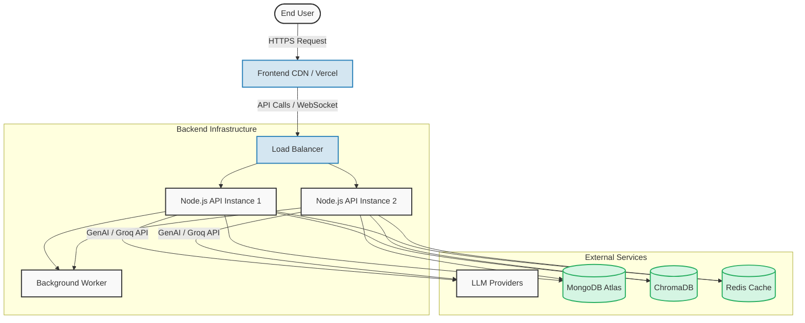

# Chapter 14: Deployment & Architecture

A solid deployment strategy ensures that the **AI Study Buddy** application is highly available, secure, and scalable. This chapter outlines the entire deployment lifecycle, from containerization to setting up a fully integrated CI/CD pipeline, and provides a clear architectural blueprint for production.

---

## Deployment Architecture

The following diagram illustrates the recommended production architecture for the AI Study Buddy application:

---

## 1. Frontend Hosting

The frontend is built with React and Vite. Unlike dynamic backends, the React app is compiled down to static HTML, CSS, and JS files.

- **Recommended Platforms:** Vercel, Netlify, or AWS CloudFront (S3).
- **Why?** These platforms utilize a Global CDN (Content Delivery Network). When a user requests the application, the assets are served from an edge server geographically closest to them, leading to extremely fast load times.
- **Deployment:** Vercel automatically detects the Vite framework, runs `npm run build`, and deploys the `dist` folder.

## 2. Backend Hosting

The Node.js and Express backend needs a runtime environment capable of handling long-running processes, WebSockets, and API requests.

- **Recommended Platforms:** Render, Heroku, AWS Elastic Beanstalk, or AWS ECS (Elastic Container Service).
- **Process Management:** In production, do not use `nodemon`. Instead, use process managers like **PM2** or Docker containers. PM2 can automatically restart the app on crashes and utilize all available CPU cores via cluster mode.

## 3. MongoDB Atlas

Hosting MongoDB yourself is complex and risky. **MongoDB Atlas** is the recommended managed database service.

- **Setup:** Create a dedicated cluster (e.g., M10 or M20 for production).
- **Security:** Ensure Network Access is restricted (IP Whitelisting) so that only your backend server IPs can connect to the database. Use strong authentication and role-based access control (RBAC).

## 4. Docker

Docker standardizes environments across development, testing, and production.

- **Containerization:** Create a `Dockerfile` for the backend. This ensures that the Node.js version and underlying OS dependencies (essential for tools like `pdf-parse` or ChromaDB) match exactly across all environments.
- **Docker Compose:** Use `docker-compose.yml` to spin up the backend, a local MongoDB instance, and Redis together for local development without polluting the host machine.

## 5. CI/CD (Continuous Integration / Continuous Deployment)

CI/CD pipelines automate the testing and deployment process.

- **GitHub Actions:** Create a `.github/workflows/deploy.yml` pipeline.
- **Workflow Steps:**
  1. **Linting & Formatting:** Run ESLint and Prettier.
  2. **Testing:** Run backend Jest tests and any frontend component tests.
  3. **Build Image:** If tests pass, build the Docker image and push it to a container registry (like Docker Hub or AWS ECR).
  4. **Deploy:** Trigger a webhook to Render/AWS to pull the latest image and restart the service.

## 6. Environment Variables

Secrets should **never** be hardcoded or pushed to GitHub.

- **.env Files:** Keep `.env` files strictly in `.gitignore`.
- **Production Injection:** In Vercel or Render dashboards, inject production values for variables like `MONGO_URI`, `GEMINI_API_KEY`, and `JWT_SECRET`.
- **Validation:** Use a library like `Zod` in your backend configuration file to validate that all required environment variables are present before the server starts, preventing silent crashes later.

## 7. HTTPS & Domain Management

Security is non-negotiable, especially when handling authentication tokens and user chat data.

- **Domains:** Purchase a custom domain (e.g., `aistudybuddy.com`) via Route 53, Cloudflare, or Namecheap.
- **HTTPS/SSL:** Vercel and Render automatically provision free SSL certificates via Let's Encrypt. If using AWS, configure an Application Load Balancer (ALB) with an AWS Certificate Manager (ACM) SSL cert. All non-HTTPS traffic must be forcefully redirected to HTTPS.

## 8. Monitoring & Logging

When things go wrong in production, you need visibility.

- **Logging:** Replace `console.log` with a robust logger like **Winston** or **Pino**. Log outputs in JSON format so they can be easily indexed.
- **Centralized Logs:** Send logs to Datadog, Loggly, or AWS CloudWatch.
- **Error Tracking:** Integrate **Sentry** on both the frontend and backend to get instant alerts and stack traces when unhandled exceptions occur.
- **Uptime Monitoring:** Use tools like Better Uptime or UptimeRobot to ping a dedicated `/health` endpoint every minute.

## 9. Scaling Strategies

As AI Study Buddy gains users, a single server will eventually bottleneck.

- **Horizontal Scaling:** Spin up multiple Node.js backend instances behind a Load Balancer. Since Express is stateless, any instance can handle any request.
- **Statelessness:** Ensure session data (like API rate limits or active WebSocket connections) is moved out of Node.js memory and into **Redis**.
- **Database Scaling:** Upgrade the MongoDB Atlas tier, implement read replicas to offload heavy analytical queries, and ensure proper indexing for fast data retrieval.
