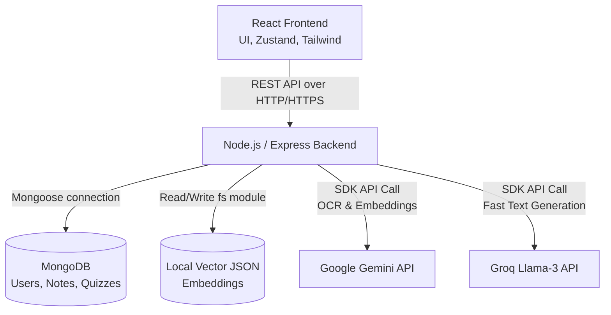
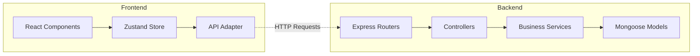
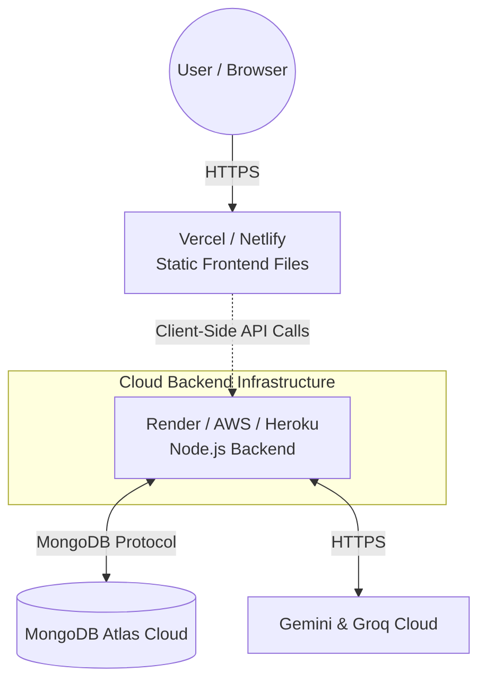
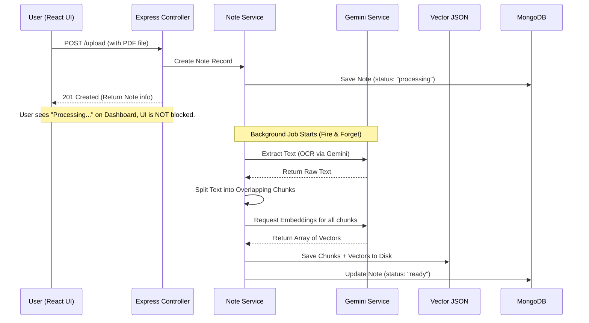
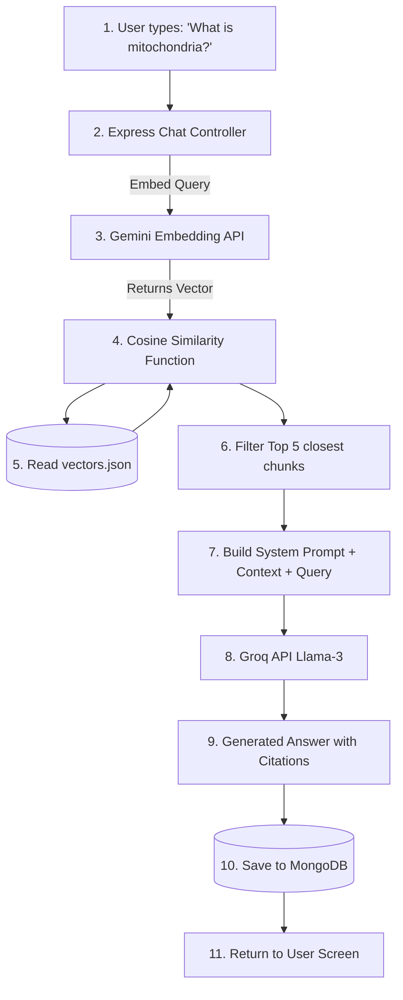

# Chapter 2: The Complete Architecture (Deep Dive)

Welcome to Chapter 2! Yeh chapter aapka "Bramhastra" (ultimate weapon) hai. System Design aur Architecture interviews ka core yahi hota hai. Yahan hum har ek component ko open karenge, uska flow samjhenge, aur diagrams ke through visualise karenge. 

Saare technical terms English mein rahenge, lekin explanation simple Hinglish mein hai with real-life analogies.

---

## 🏗️ 1. High-Level Architecture (HLA)

System architecture ek restaurant jaisa hota hai:
- **Frontend (Client):** Restaurant ka waiter (jo order leta hai aur khana serve karta hai).
- **Backend (Server):** Kitchen ka manager (jo decide karta hai order kaise banega).
- **Database (MongoDB):** Pantry/Fridge (jahan ingredients store hote hain).
- **AI APIs (Gemini & Groq):** Specialized external chefs (jo specific complex dishes banate hain).

### Explanation of the Arrows (How they communicate):
1. **Frontend to Backend:** React (Zustand state se) **Axios** ka use karke HTTP REST API calls karta hai (e.g., `POST /api/chat/ask`). JWT token "Authorization" header ya cookies mein jaata hai.
2. **Backend to MongoDB:** Backend **Mongoose** library ka use karta hai TCP connection par data read/write karne ke liye.
3. **Backend to Vector JSON:** Node.js ka native `fs` (file system) module local disk par rakhi `vectors.json` file ko read aur write karta hai.
4. **Backend to AI (Gemini/Groq):** Backend official SDKs (`@google/genai` aur `groq-sdk`) ka use karta hai external cloud APIs ko secure HTTP calls karne ke liye. API keys backend environment (`.env`) mein safe rehti hain.

---

## 🧩 2. Component Diagram

Backend ko humne layers mein divide kiya hai taaki code "spaghetti" (messy) na bane. Ise **Controller-Service-Model** pattern kehte hain.

### Component Breakdown & "Why does it exist?"

#### 1. React Frontend (Vite + Tailwind)
- **Why it exists:** User ko ek interactive GUI dene ke liye.
- **What if we remove it?** Users ko Postman ya Command Line (CLI) use karke API hit karni padegi (jo aam user nahi kar sakta).

#### 2. Zustand (State Management)
- **Why it exists:** Pure app (multiple pages) mein data (jaise logged-in user, ya chat history) ko sync rakhne ke liye.
- **What if we remove it?** React Context ya Redux use karna padega (Redux ka code bahut lamba hota hai, aur Context baar-baar re-renders karwata hai).

#### 3. Express Controllers
- **Why it exists:** Sirf HTTP Request (body, params) read karne aur Response bhejne ke liye. Yeh restaurant ka order taker hai.
- **What if we remove it?** Router file mein hi saara business logic likhna padega, jisse testing hard ho jayegi aur file bahut badi ho jayegi.

#### 4. Business Services (e.g., `chat.service.js`)
- **Why it exists:** Yeh core logic likhne ke liye hai. "RAG kaise chalega?", "PDF kaise parse hogi?" - yeh sab Services mein hota hai. Yeh Kitchen ka main chef hai.
- **What if we remove it?** Logic controllers mein daalna padega. Phir code reusability khatam ho jayegi (e.g., agar ek hi kaam 2 alag API routes ko karna ho).

#### 5. Local Vector Store (`vectors.json`)
- **Why it exists:** Embeddings (numbers ka array) ko save karne ke liye taaki unme Cosine Similarity math lagaya ja sake.
- **What if we remove it?** RAG chal hi nahi sakta. Humein dedicated database (ChromaDB ya Pinecone) ka setup karna padega jo local development ke liye heavy hota hai.

---

## 🚀 3. Deployment Diagram

Interviewers puchte hain: "Is project ko live kaise karoge?"

### How Data Flows in Deployment:
1. User ka browser Vercel se static HTML/JS/CSS files fetch karta hai (super fast kyunki CDN edge locations par hota hai).
2. Browser mein React app load hone ke baad, wo API calls seedha Render/AWS par host huye Node.js backend ko bhejta hai.
3. Backend MongoDB Atlas (fully managed cloud database) se data fetch/save karta hai.

---

## ⏱️ 4. Sequence Diagram: PDF Upload & Asynchronous Processing

Yeh diagram project ka sabse bada engineering feat dikhata hai: **Background Processing**. Agar hum API response roke rakhte, toh PDF parse hone mein time lagta aur user ki screen hang ho jati.

### Explanation of Data Flow:
- **Client (U)** ne PDF bheji.
- **Controller (C)** ne DB mein ek entry daali jiska status tha `"processing"`, aur turant User ko `201 Success` bhej diya.
- Piche (background mein), **Service (S)** ne Gemini API se text nikalwaya, uske chunks banaye, phir embeddings banwayi.
- End mein, DB update ho gaya to `"ready"`. User jab dashboard refresh karega, use file ready milegi.

---

## 🔄 5. Data Flow Diagram: RAG Pipeline (How Chat Works)

Retrieval-Augmented Generation (RAG) ka complete journey ek hi query ke liye:

### Explanation of Data Flow (RAG):
1. **User asks a question.**
2. Backend us exact question ko Gemini ke paas bhej kar **numbers (vector embedding)** mein convert karta hai.
3. Backend apne local `vectors.json` mein saare purane chunks nikalta hai, aur **Cosine Similarity** (ek math formula) lagakar dekhta hai ki question ka vector kin top 5 notes ke vectors se sabse zyada match karta hai.
4. Un 5 chunks (context) ko ek prompt mein inject kiya jata hai: *"Use the following context to answer: [chunks]... Question: [user query]"*.
5. Yeh prompt **Groq** ko bheja jata hai. Groq super-fast Llama-3 model use karke sirf context ke basis par answer likhta hai.
6. Answer ko MongoDB mein save karte hain aur User ko frontend par dikha dete hain.

---

## 🎯 Generated Interview Questions (Based on Architecture)

1. **"Tumne React se direct Gemini/Groq APIs kyun nahi call ki? Backend kyun lagaya?"**
   - *Answer:* "Agar main React (Frontend) se direct APIs call karta, toh mujhe apni secret API keys (Groq/Gemini) frontend code mein daalni padti, jo DevTools se koi bhi chura sakta hai. Backend ek secure middleman ka kaam karta hai, secrets safe rakhta hai, aur Rate Limiting (abuse rokne ke liye) apply karta hai."

2. **"Agar kal ko humare paas 100,000 users aa jayein, toh tumhara architecture kahan fail hoga aur tum use kaise fix karoge?"**
   - *Answer:* "Sabse pehle fail hoga mera local `vectors.json` file. Disk I/O bottlenecks aayenge aur file corrupt ho sakti hai. Isko fix karne ke liye main is JSON approach ko replace karke ek distributed Vector DB jaise **Pinecone** ya **Weaviate** lagaunga. Dusra, background PDF processing Node.js ke event loop par thoda pressure daalti hai; use main ek alag worker server aur Redis Queue (BullMQ) par shift kar dunga."

3. **"Zustand kyun use kiya? Redux ya Context API kyun nahi?"**
   - *Answer:* "Redux over-engineered (bahut zyada boilerplate) hota hai is size ke project ke liye. Context API ka issue yeh hai ki jab bhi state update hoti hai, saare child components be-wajah re-render hote hain. Zustand lightweight hai, aur component-level subscription deta hai, jisse performance achi rehti hai."

4. **"Tumne PDF OCR ke liye Gemini kyun use kiya? pdf-parse jaisi open-source library kafi nahi thi?"**
   - *Answer:* "Standard `pdf-parse` library complex layouts (tables, double columns, mathematical formulas) ko read karne mein fail ho jati hai aur kachra (garbage text) output deti hai. Gemini OCR AI-based document understanding use karta hai jisse context preserve rehta hai, jo ki RAG pipeline ki accuracy ke liye sabse important step hai."

---

## ⚡ Quick Revision Notes for Chapter 2
- **Architecture Pattern:** Client-Server with Controller-Service-Model isolation.
- **RAG Data Flow:** Query -> Embed -> Vector Search -> Prompt Injection -> LLM Generation.
- **Async Magic:** PDF processing blocks UI? NO! Immediate 201 response -> Process in background -> Save to DB.
- **Security Key:** Frontend *never* talks to AI directly. Backend handles all external API calls safely.
- **Local Fallbacks:** Embeddings saved locally in JSON to make local dev painless, but requires Pinecone for production scale. 

---
*Ready to ace the architecture round! In the next chapter, we will look deeply into the code implementation of these services.*
