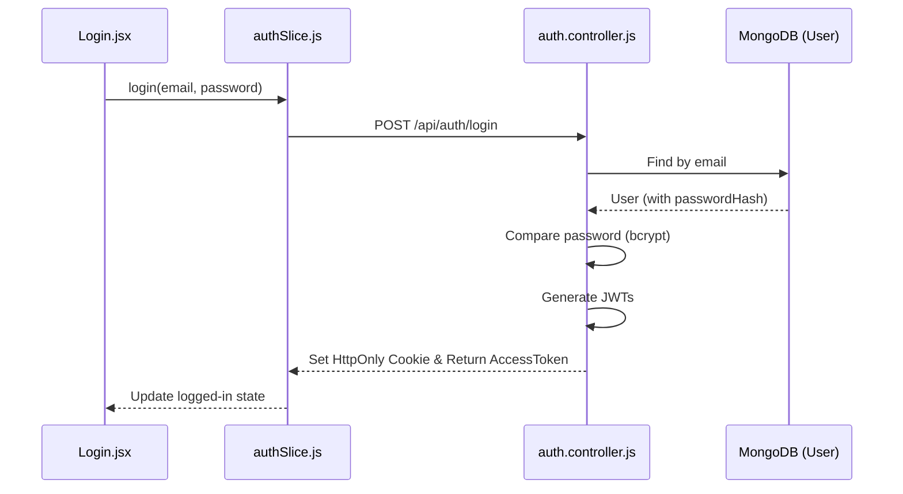
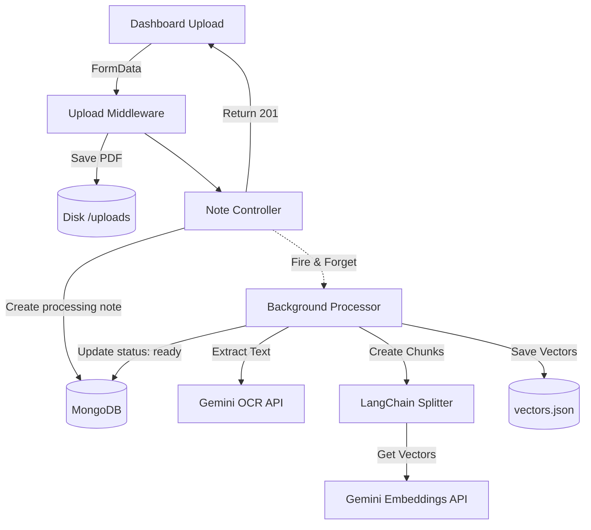
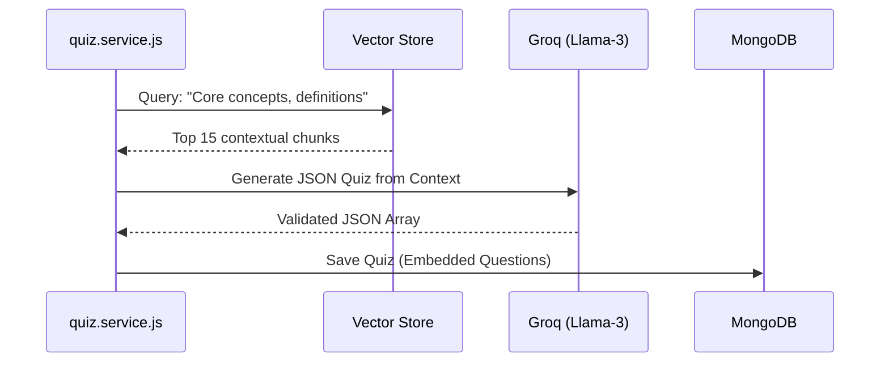

# Chapter 3: Feature-by-Feature Deep Dive

Yeh chapter aapka "X-Ray Vision" hai. Interviewer jab puchega "Explain what happens when a user clicks 'Generate Quiz'?", toh aapko exactly pata hoga ki konsi file se shuru ho kar data kahan jata hai.

Yahan hum har feature ka A-to-Z flow samjhenge in easy Hinglish.

---

## 🔐 1. Authentication (Signup, Login, Logout)

Auth system security ka core hai. Yahan JWT (JSON Web Tokens) aur bcrypt use hota hai.

### Flow Breakdown
- **Frontend Flow:** User React form (`Login.jsx` ya `Register.jsx`) fill karta hai. Zustand ka `authSlice.js` action trigger hota hai jo `services/_adapter.js` (Axios) ke through POST request bhejta hai.
- **Backend Flow:** Request `routes/auth.routes.js` par aati hai. `validate.middleware.js` (Zod) pehle body check karta hai (e.g., email format). Phir `auth.controller.js` request body extract karke `auth.service.js` ko pass karta hai.
- **Database Flow:** `auth.service.js` DB check karta hai. Agar signup hai, toh `User.model.js` ka `pre('save')` hook password ko **bcrypt** se hash karta hai. Phir JWT tokens (Access & Refresh) generate hote hain.
- **Response Flow:** Refresh token ko **HttpOnly Cookie** mein set kiya jata hai (XSS attacks se bachne ke liye) aur Access token JSON response mein frontend ko bheja jata hai. Logout ke time pe backend simply cookie ko clear kar deta hai.

### Files Involved
- Frontend: `src/pages/Login.jsx`, `src/pages/Register.jsx`, `src/store/slices/authSlice.js`
- Backend: `src/routes/auth.routes.js`, `src/controllers/auth.controller.js`, `src/services/auth.service.js`, `src/models/User.model.js`

---

## 📄 2. PDF Upload (Note Creation)

Yeh app ka sabse heavy feature hai kyunki isme asynchronous background jobs aur AI involved hain.

### Flow Breakdown
- **Frontend Flow:** User Dashboard par file upload karta hai. `noteSlice.js` FormData banakar `/upload` par bhejta hai.
- **Backend Flow:** `note.routes.js` par pehle `upload.middleware.js` (Multer) file ko intercept karke disk (`/uploads` folder) par save karta hai. `note.controller.js` turant MongoDB mein ek Note banata hai jiska status `"processing"` hota hai aur user ko response de deta hai (taaki UI hang na ho).
- **AI Flow (Background Job):** Controller ek background function `processPdfInBackground` chalata hai.
  1. `pdf.service.js` Gemini OCR ko file bhejta hai text extract karne ke liye (ya fallback mein `pdf-parse` use karta hai).
  2. `embeddings.service.js` text ke chunks (tukde) banata hai aur Gemini Embeddings API se har chunk ka vector (numbers) generate karwata hai.
- **Database Flow:** Vectors local `vectors.json` mein save hote hain, aur Mongoose Note document ka status `"ready"` update kar deta hai.

### Files Involved
- Frontend: `src/pages/Dashboard.jsx`, `src/store/slices/noteSlice.js`
- Backend: `src/middlewares/upload.middleware.js`, `src/controllers/note.controller.js`, `src/services/pdf.service.js`, `src/services/embeddings.service.js`

---

## 💬 3. Chat (RAG)

Yeh app ka 'magic' feature hai jahan user apne notes se baat karta hai.

### Flow Breakdown
- **Frontend Flow:** `Chat.jsx` mein user message type karta hai. `chatSlice.js` query backend ko bhejta hai.
- **Backend Flow:** `chat.routes.js` `llmLimiter` se rate-limiting check karta hai. `chat.controller.js` check karta hai ki existing chat hai ya nayi. Phir `chat.service.js` ko call lagti hai.
- **AI Flow (RAG Pipeline):**
  1. User ka message `rag.service.js` ke paas jata hai.
  2. Query ka vector banta hai (Gemini).
  3. Local `vectors.json` mein search hota hai (Cosine Similarity). Top 5 related chunks nikalte hain.
  4. System prompt banta hai jisme chunks daale jate hain aur **Groq (Llama-3)** API ko bheja jata hai taaki lightning-fast response aaye.
- **Database Flow:** User ka message aur AI ka response dono `Message.model.js` mein save hote hain.
- **Response Flow:** Citations (chunks/page numbers) ke sath AI answer frontend ko milta hai.

### Files Involved
- Frontend: `src/pages/Chat.jsx`, `src/store/slices/chatSlice.js`
- Backend: `src/controllers/chat.controller.js`, `src/services/chat.service.js`, `src/services/rag.service.js`, `src/models/Message.model.js`

---

## 📝 4. Quiz Generation

User ek click par multi-choice questions generate karta hai.

### Flow Breakdown
- **Frontend Flow:** `Quizzes.jsx` se request jati hai with difficulty and question count.
- **Backend Flow:** `quiz.controller.js` -> `quiz.service.js`.
- **AI Flow:** Pura note read karne ke bajaye, system `embeddings.service.js` ka use karke PDF ke sabse "important" chunks nikalta hai (Semantic Search for "Key concepts"). Un chunks ko Groq Llama-3 ko bheja jata hai explicitly JSON output mangne ke liye (e.g., 4 options, 1 correct answer).
- **Database Flow:** Groq ka response validate hota hai, aur `Quiz.model.js` mein embedded array of questions ban kar save ho jata hai.

### Files Involved
- Backend: `src/controllers/quiz.controller.js`, `src/services/quiz.service.js`, `src/models/Quiz.model.js`

---

## 🃏 5. Flashcard Generation & Study Session

Spaced Repetition ke basis par flashcards kaam karte hain.

### Flow Breakdown
- **AI Flow (Generation):** Same as quizzes, important chunks nikal kar Groq se JSON arrays banwaye jate hain (Front, Back, Tags).
- **Database Flow (Study Session):** Yeh interesting hai. Jab user session start karta hai, `flashcard.service.js` mein ek MongoDB Aggregation ya JS sort logic chalta hai. Jo cards "unseen" ya "needs review" hain aur purane hain (`lastReviewedAt`), unhe pehle fetch kiya jata hai (Max 20 cards per session).
- **Frontend Flow:** `FlashcardSession.jsx` mein Framer Motion se 3D flip effect milta hai. User "Got it" ya "Needs Review" mark karta hai, jo backend mein us card ka `masteryStatus` update karta hai.

### Files Involved
- Frontend: `src/pages/Flashcards.jsx`, `src/pages/FlashcardSession.jsx`, `src/store/slices/flashcardSlice.js`
- Backend: `src/controllers/flashcard.controller.js`, `src/services/flashcard.service.js`, `src/models/FlashcardDeck.model.js`

---

## 📊 6. Profile & Dashboard (Progress Tracking / History / Search)

User ki overall growth aur history track karna.

### Flow Breakdown
- **Frontend Flow:** `Dashboard.jsx` par aate hi API hit hoti hai to fetch metrics.
- **Backend Flow:** `dashboard.controller.js` -> `dashboard.service.js`.
- **Database Flow:** Yahan MongoDB ki **Aggregation Pipeline** use hoti hai. 
  - Backend ek hi baar mein `Promise.all()` use karke alag-alag collections (`Notes`, `Quizzes`, `FlashcardDecks`, `Chats`) ko query karta hai.
  - Quizzes ke andar total attempts, Flashcards ke andar `size` of cards array, aur Chats mein activity over last 7 days ($group by date) calculate hoti hai.
- **Response Flow:** Ek heavily aggregated JSON response fronted ko milta hai jo progress bars aur charts mein render hota hai.

### Files Involved
- Frontend: `src/pages/Dashboard.jsx`, `src/pages/Profile.jsx`, `src/store/slices/uiSlice.js`
- Backend: `src/routes/dashboard.routes.js`, `src/services/dashboard.service.js`

---

## 🎯 Generated Interview Questions

1. **Upload Flow:** "User ek 50MB ki PDF upload karta hai. System usko kaise handle karega?"
   *Answer:* Multer limit check (10MB max set hai humare config mein) turant usko block kar dega without reading the whole file into RAM, saving server resources.
   
2. **Chat Flow:** "Agar user PDF ke baahar ki aam baat karta hai (e.g., 'Who is the president of USA?'), toh RAG architecture kaise react karega?"
   *Answer:* Kyunki prompt mein explicitly likha hai: "Answer ONLY using the context. If not found, say I don't know", model politely mana kar dega. Yeh hallucination prevention mechanism hai.

3. **Dashboard Flow:** "Dashboard par multiple widgets hain (Quiz stats, Flashcard stats). Kya frontend se 5 alag API calls lagani chahiye ya 1?"
   *Answer:* Humne 1 `/api/dashboard` endpoint banaya hai jo backend par `Promise.all()` use karke parallel DB queries marta hai. Ek call se network overhead kam hota hai aur UX fast lagta hai.

4. **Security Flow:** "Authentication ke time pe `HttpOnly` cookie kyun use ki? `localStorage` kyun nahi?"
   *Answer:* `localStorage` JavaScript se accessible hai, jiska matlab XSS (Cross-Site Scripting) attack se hacker token chura sakta hai. `HttpOnly` cookies ko browser JS read nahi kar sakta, jo unhe XSS-proof banata hai.

---

## ⚡ Quick Revision Notes for Chapter 3
- **Signup/Login:** Uses bcrypt for hashing, JWT for tokens, HttpOnly cookies for security.
- **PDF Upload:** Async Fire-and-Forget flow. `pdf-parse` / Gemini OCR -> Langchain Splitter -> Gemini Embeddings -> JSON File.
- **Chat:** User Query -> Embedding -> Cosine Similarity -> Prompt + Top 5 Chunks -> Groq Llama 3 -> Response.
- **Quizzes:** Generated by explicitly asking Groq for JSON formatting. Embedded array schema in Mongo.
- **Flashcards:** Custom spaced-repetition sorting (`masteryStatus` + `lastReviewedAt`).
- **Dashboard:** Uses MongoDB aggregation and `Promise.all()` for parallel fast queries. 

---
*Boom! Now you know exactly what happens under the hood when a button is clicked. Next, practice speaking out these flows aloud.*
