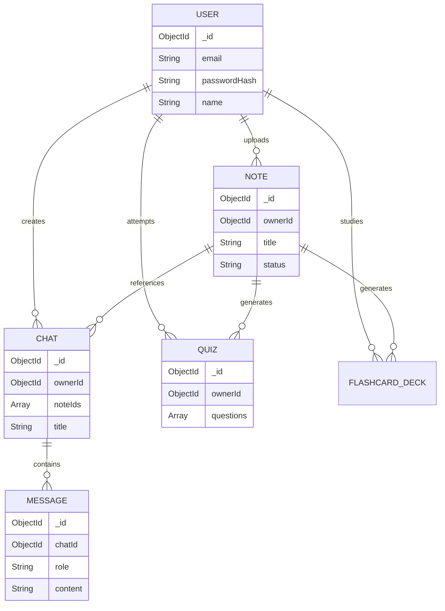

# Chapter 7: The Database Masterclass (MongoDB Deep Dive)

Welcome to Chapter 7! Ek backend engineer ko database samajhna utna hi zaroori hai jitna ek chef ko apne ingredients samajhna. Is chapter mein hum MongoDB, schema design tradeoffs, aur real-world relationships ko simplify karenge with real-life analogies.

---

## 🗂️ 1. MongoDB Basics (Explain like I'm 5)

MongoDB ek **NoSQL (Not Only SQL)** database hai. Iska matlab yeh data ko tables (rows/columns) mein nahi, balki JSON jaisi (BSON) files mein save karta hai.

### Collections & Documents
- **Collection (Folder):** Ek bada folder (e.g., `Users`). SQL mein isey "Table" bolte hain.
- **Document (File):** Us folder ke andar rakhi ek file (e.g., User A ki details). SQL mein isey "Row" bolte hain.
- **Analogy:** Maan lo SQL ek Excel sheet hai jahan har cheez row aur column mein fit honi chahiye. MongoDB ek digital file cabinet hai. Har user ki details ek JSON object (chitthi) par likh kar folder (collection) mein daal di jati hai. Is chitthi mein zaroori nahi ki sabka format 100% same ho (Flexible Schema).

---

## 🔍 2. Indexes & Queries

### Queries
Queries simple sawaal hote hain jo hum DB se puchte hain. (e.g., `User.find({ email: "test@test.com" })`).

### Indexes
- **What:** Indexing DB ki speed badhane ka tarika hai.
- **Analogy:** Ek 1000 pages ki kitab mein agar aapko ek word dhoondhna ho, toh bina Index ke aapko page 1 se 1000 tak padhna padega (**Collection Scan** - very slow). Agar kitab ke piche Index page hai, toh aap word dekhte ho, direct page number par jate ho (**Index Scan** - lightning fast!).
- **Usage:** AI Study Buddy mein humne `dashboard` ke feeds ke liye `{ ownerId: 1, createdAt: -1 }` par "Compound Index" (2 fields ko jod kar index) lagaya hai, taaki user ka dashboard turant load ho.

---

## 🏭 3. Aggregation Pipeline

- **What:** Jab simple queries (find, update) kaam nahi aati, toh data ko filter, transform aur compute karne ke liye Aggregation use hoti hai.
- **Analogy:** Factory ki assembly line. 
  1. Pehle data aata hai `$match` (Chhanni/Filter - sirf ek user ka data lo).
  2. Phir `$unwind` hota hai (Array ko kholna).
  3. Phir `$group` hota hai (Data ko categories mein jodna aur sum/average nikalna).
  4. End mein packed data milta hai.
- **Usage in App:** Humare `dashboard.service.js` mein total flashcards aur average quiz score nikalne ke liye Aggregation pipelines ka use hota hai taaki saara math database khud kar de aur Node.js ka CPU free rahe.

---

## 🔗 4. Relationships & Schema Design (Trade-offs)

Yeh interview ka sabse important part hai. NoSQL mein data ko link karne ke 2 tarike hote hain: **Embedding** aur **Referencing**. MongoDB mein har document ki ek hard limit hoti hai: **16MB maximum size**.

### 1. Embedding Pattern (Daal do andar)
- **Concept:** Ek document ke andar hi dusre data ko Array ya Object mein save karna.
- **Example:** Humare project mein **Quizzes**. Ek quiz ke maximum 20 questions hote hain. Humne questions ko alag collection mein nahi dala, balki usko Quiz document ke andar hi ek `questions` array mein embed kar diya.
- **Trade-off:**
  - ✅ **Pro:** Read speed super fast hoti hai kyunki data ek hi jagah mil jata hai (No Joins).
  - ❌ **Con:** Agar data infinitely grow karega (jaise chats), toh document 16MB limit cross kar ke crash ho jayega.

### 2. Referencing Pattern (ID save karo)
- **Concept:** Do alag documents (collections) banana, aur ek ki `_id` dusre mein save karna (Like Foreign Key in SQL).
- **Example:** Humare project mein **Chats aur Messages**. Humne saare messages ko Chat ke andar embed nahi kiya. Chat alag banti hai, aur har Message mein `chatId` daal kar use alag collection mein save karte hain. 
- **Trade-off:**
  - ✅ **Pro:** Data kitna bhi grow kar sakta hai. 16MB limit ka darr nahi.
  - ❌ **Con:** Data lane ke liye do baar query karni padti hai ya `$lookup` (MongoDB Join) lagana padta hai, jo thoda slow hota hai.

---

## 🗺️ 5. ER Diagram (Entity Relationship)

Yahan humara Database structure visualized hai:

---

## 🛡️ 6. Mongoose & Transactions

### Mongoose Kya Hai?
- **Analogy:** MongoDB basically ek kabaad khana (junkyard) hai jahan aap kisi bhi shape ya size ka JSON daal sakte ho (Schema-less). **Mongoose** ek Strict Bouncer/Translator hai. Mongoose ensure karta hai ki email hamesha 'String' ho, age hamesha 'Number' ho, aur required fields miss na hon (Schema enforcement). 

### Transactions (ACID)
- **Concept:** Agar ek action mein multiple database updates hain (e.g., Bank mein A se paise kate aur B mein gaye), toh ya toh DONO success hone chahiye, ya DONO fail (Rollback). Isey transaction kehte hain. 
- MongoDB 4.0 ke baad se Multi-document transactions support karta hai.

---

## ⚔️ 7. Database Comparisons (Trade-offs)

#### 🆚 MongoDB vs MySQL
- **MySQL (SQL/Relational):** Data strict tables mein hota hai. Agar aapko column add karna hai, toh poori table alter karni padegi (jo bade scale par slow hota hai). Financial apps aur strict relationships (Joins) ke liye best hai.
- **MongoDB (NoSQL):** Schema flexible hai. Kal naya feature aaya toh seedha naya field JSON mein dal do, database alter nahi karna padta. Fast prototyping, heavy read operations, aur unstructured data (like chat logs, AI responses) ke liye best hai. Humne AI Study Buddy ke liye MongoDB chuna kyunki AI outputs JSON arrays mein aate hain (jaise quiz questions) jinhe embed karna aasan hota hai.

#### 🆚 MongoDB vs PostgreSQL
- **PostgreSQL:** Yeh MySQL ka advance level hai. Yeh ek SQL database hai lekin yeh JSON objects bhi bakhubi handle kar leta hai. Yeh technical community ka favorite hai (best of both worlds).
- **Why we chose Mongo over Postgres?** Kyunki pure app ka stack JavaScript (MERN) hai. MongoDB seedha JSON samajhta hai aur React/Node se perfectly align hota hai. No ORM setup overhead.

#### 🆚 MongoDB vs Firebase
- **Firebase:** Google ka NoSQL database hai (Firestore). Yeh Real-time features natively deta hai bina websockets likhe.
- **Why we chose Mongo?** Firebase mein vendor lock-in (aap Google ke rules par phase rahoge) hota hai aur complex queries (jaise aggregations jo dashboard mein chahiye) Firebase mein kafi mushkil aur costly (per-read billing) hoti hain. MongoDB flexible aur cheaper (self-hosted ya Atlas) hai.

---

## 🎯 Generated Interview Questions

**Q: Tumne Chats ke messages ko Chat document ke andar ek array banakar save kyu nahi kiya?**
**A:** "Agar main messages ko embed karta, toh ek lambi conversation hone par document ka size badh kar 16MB limit ko cross kar jata aur app crash ho jati. Isliye maine **Reference Pattern** use kiya jahan Messages ek alag collection mein store hote hain aur unme `chatId` index hoti hai, allowing infinite conversation history and pagination."

**Q: Mongoose ka use kyun kiya jab MongoDB native driver pehle se aata hai?**
**A:** "MongoDB natively schema-less hai. Ek complex application mein agar hum schema enforce nahi karenge toh corrupt/invalid data save hone ka dar rehta hai. Mongoose humein schema validation, pre/post save hooks (jaise password hashing), aur populate jaisi utilities deta hai jo dev speed fast karti hain."

**Q: SQL ki jagah NoSQL kyun use kiya is AI project ke liye?**
**A:** "Generative AI ka output hamesha predictable rows/columns mein fit nahi hota. Ek Quiz mein 4 options ho sakte hain, kisi mein 5. MongoDB ek JSON document store hai. Jo JSON (Structured Output) mujhe Groq API (LLM) se milta hai, use bina complex SQL joins ke, seedha as an embedded array MongoDB mein save karna highly efficient tha."

**Q: Aggregation Pipeline kya hoti hai aur tumne ise kahan use kiya?**
**A:** "Aggregation Pipeline complex data processing (filter, group, sort) karne ka ek framework hai DB ke andar. Maine ise `dashboard.service.js` mein use kiya taaki total flashcards, recent activity aur average quiz score direct database layer par calculate ho jaye, aur mera backend Node server RAM free rakhe."

---
*Boom! Now you understand NoSQL database design patterns. Interviewer ko Jab aap 16MB limit aur Reference vs Embedding ka trade-off bataoge, unko lagega aap ek true Senior Engineer ho.*
