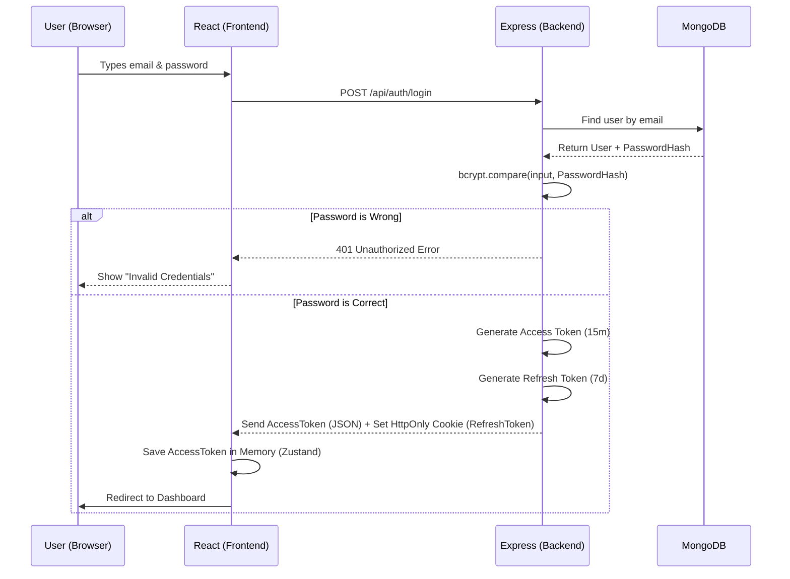

# Chapter 8: The Security Masterclass (Auth, JWT, & Cookies)

Welcome to Chapter 8! Authentication aur Security backend engineers ka sabse favorite interview topic hai. Is chapter mein hum samjhenge ki user login kaise karta hai, tokens kya hote hain, aur apne system ko hackers se kaise bachaya jata hai.

---

## 🛂 1. Authentication vs Authorization (The Airport Rule)

Interviewer ka sabse pehla basic question yahi hota hai:
- **Authentication (AuthN):** "Tum kaun ho?" (Identity check). 
  - *Analogy:* Airport par gate pe apni ID aur Passport dikhana.
- **Authorization (AuthZ):** "Tumhe kya karne ki permission hai?" (Access check). 
  - *Analogy:* Aapke paas economy class ki ticket hai, par aap VIP Lounge mein ghusne ki koshish kar rahe ho. Bouncer aapko authorize nahi karega. App mein ise **RBAC (Role Based Access Control)** kehte hain (Admin vs User).

---

## 🔒 2. How we store Passwords: `bcrypt`

- **Concept:** Hum kabhi bhi plain text password (jaise `password123`) database mein save nahi karte. Agar DB hack ho gaya toh sab users ke passwords leak ho jayenge. Hum **Hashing** use karte hain.
- **Analogy:** Password ko ek juicer (blender) mein daal kar mix kar dena. Jo juice nikla, use Hash kehte hain. Ab koi bhi us juice se wapas fruits (original password) nahi bana sakta (One-Way function).
- **In our App:** Jab user register karta hai, Mongoose ka `pre('save')` hook `bcrypt.hash()` call karta hai aur DB mein sirf gibberish string save karta hai. Login ke time, `bcrypt.compare()` user ke input ko usi juicer mein daalta hai aur check karta hai ki kya naya juice aur purana juice match karte hain.

---

## 🎟️ 3. Sessions vs JWT (Why JWT is better for scale)

### Session Based Auth (Stateful)
- **Analogy:** Ek Hotel jahan har guest ka naam ek bade Register (Server Memory ya Redis DB) mein likha jata hai.
- **Problem:** Agar hotel itna bada ho jaye ki 3 alag-alag reception (Server 1, 2, 3) banani padein, toh ek reception ko pata nahi chalega ki dusri reception ke register mein guest ka naam hai ya nahi. Isey scale karna mushkil hai.

### JWT - JSON Web Tokens (Stateless)
- **Analogy:** Ek Music Festival ka VIP Wristband (Band). Ek baar aapko band pehna diya, ab aap kisi bhi gate par jao, bouncer sirf band ki stamp (Signature) dekhega. Use baar-baar main register check karne ki zaroorat nahi hai.
- **Why it's better:** Server ko memory mein kuch save nahi karna padta. Token frontend ke paas rehta hai, jisse system easily hazaron users ke liye scale ho jata hai.

---

## 🍪 4. The Token Architecture (Access, Refresh, Expiry & Cookies)

Agar VIP wristband chori ho gaya toh? Koi bhi aapke naam se ghus jayega! Isiliye hum ek dual-token system use karte hain.

### 1. Access Token (Short-lived)
- Yeh 15-30 minute mein expire ho jata hai. Agar kisi hacker ko mil bhi gaya, toh wo sirf 15 minute hi active rahega.

### 2. Refresh Token (Long-lived)
- Yeh 7 din ya 1 mahine chalta hai. Iska sirf ek kaam hai: Jab Access Token expire ho jaye, toh naya Access Token lekar aana bina user ko baar-baar login page dikhaye.

### Security Risks (XSS vs CSRF) & Mitigation
- **XSS (Cross-Site Scripting):** Agar aap Refresh Token ko browser ke `localStorage` mein save karte ho, toh koi malicious JavaScript code us token ko read kar ke chura sakta hai.
- **The Solution:** Hum Refresh Token ko **`HttpOnly` Cookie** mein set karte hain. Iska faida yeh hai ki browser ki JavaScript ise read nahi kar sakti. Yeh sirf tabhi server ko jata hai jab browser khud backend ko API request bhejta hai. Yeh XSS se completely safe hai.
- **CSRF (Cross-Site Request Forgery):** Isey prevent karne ke liye hum frontend se Axios mein Authorization Header mein (Memory/Zustand mein stored) Access Token bhejte hain, aur cookies ka `SameSite=Strict` flag on rakhte hain.

---

## 🚪 5. Logout & Protected Routes

### Logout
- **Flow:** JWT stateless hota hai, toh hum usko manually server se "destroy" nahi kar sakte. Hum backend se response bhejte hain jo browser ki HttpOnly cookie ko delete (clear) kar deta hai. Uske baad token khatam, user logged out!

### Protected Routes (React & Express)
- **Express (Backend):** Ek `protect` middleware function jo har API hit hone se pehle check karta hai ki Authorization header mein valid JWT token hai ya nahi. Agar nahi, toh `401 Unauthorized` bhej deta hai.
- **React (Frontend):** Ek `<ProtectedRoute>` wrapper component jo check karta hai ki Zustand store mein user logged in hai ya nahi. Agar nahi, toh React Router use direct `/login` page par bhej (redirect) deta hai.

---

## 🗺️ 6. Login Flow Sequence Diagram

Here is exactly what happens when a user clicks "Login":

---

## 🎯 Generated Interview Questions & Answers

**Q: Tumne JWT kyun use kiya Session Auth ke bajaye?**
**A:** "SaaS apps aur modern APIs (like React + Node) ke liye JWT best hai kyunki yeh **Stateless** hota hai. Database ko har API request par user session check nahi karna padta. Token khud hi apni validity aur payload verify kar deta hai server secret key ke through, jisse app ka backend horizontal scaling (multiple servers) ke liye ready ho jata hai."

**Q: Agar ek hacker aapke user ka JWT token chura le, toh aap us hacker ko kaise rokoge jabki JWT stateless hai aur use server se destroy nahi kiya ja sakta?**
**A:** "Isiliye hum Access Token ka Expiry time bahut chhota (15 mins) rakhte hain. Hacker max 15 minute ke liye token use kar payega. Long-term authentication ke liye jo Refresh token hota hai, use hum `HttpOnly` cookie mein rakhte hain jise XSS se churaya nahi ja sakta."

**Q: LocalStorage vs Cookies. Token kahan save karna better hai aur kyun?**
**A:** "Access token ko memory (React state) mein rakhna chahiye. Refresh token ko `HttpOnly` and `Secure` Cookie mein rakhna chahiye. LocalStorage kabhi bhi safe nahi hai kyunki koi bhi third-party NPM package ya extension XSS attack karke LocalStorage read kar sakta hai."

**Q: Passwords plain text mein kyun nahi save karte, aur encryption ki jagah Hashing (bcrypt) kyun use karte hain?**
**A:** "Plain text DB leak ke time sabse badi vulnerability hai. Hum Encryption use nahi karte kyunki encryption ko decrypt kiya ja sakta hai agar hacker ko key mil jaye. Hashing ek One-Way mathematical function hai. Hash ko wapas password mein reverse karna (almost) impossible hota hai."

---
*Boom! Now you are an authentication and web security expert. You know exactly why cookies exist, how passwords are protected, and why JWT scales better than standard sessions!*
